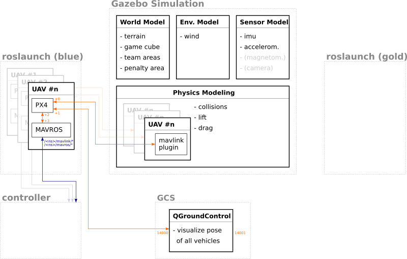

# Intro

The current concept of a two-swarm game is approximated as a cross between aerial laser tag and aerial capture the flag.

## Scenario

Each swarm controls a set of quadcopters and fixed wings aerial vehicles.
Each aerial vehicle is using the PX4 flight controller.
The vehicles start from the opposite sides of a *game cube* with an edge length of 500 m.

## Rules and Scoring

There are three primary way of scoring points:

* successfully launching and flying for a duration,
* successfully landing within a designated landing zone,
* and successfully tagging aircraft in the other swarm

In the absence of actual lasers and laser detectors or another tagging technology, tagging can be done virtually by transmitting "fire" messages over the network, and having a virtual referee evaluate those fires in light of broadcast pose data from both swarms.

For information about the rules and scoring please see the [arbiter documentation]().

## Real world vs. simulation

The scenario can either be run in the real world or within the Gazebo simulator.
In Gazebo the quadcopter is represented by a *3DR Iris* and the fixed wing by a scaled down *Cessna*.

## Overview of the system architecture

The system architecture is very similar for the real world as well as the simulator.
The following diagram shows all the components involved and how they are connected with each other.

The orange lines depict MAVLINK communication.
Each vehicle uses four ports.
For each connection the port number is indicated by an offset from the vehicle specific base port.

The blue lines depict ROS communication.
Each vehicle uses a namespace constructed from the vehicle type and its unique mavlink system id.

## Coordinate systems

In Gazebo the coordinate system used for the world and models is a follows:

* The `x` direction points from the blue team area towards the gold team area.
* The `y` direction points from the side without any area towards the penalty area.
* Therefore the `z` direction is upwards.
* The coordinate `0, 0, 50` is where the blue team area, the "no" area, and the game cube meet.

The global position information are:

* The `latitude` direction points from the blue team area towards the gold team area.
* The `longitude` direction points from the penalty area towards the side without any area.

The rendered scene in `rqt` (after rotating the view by `pi`) has the following axes:

* The `x` direction points from the penalty area towards the side without any area.
* The `y` direction points from the blue team area towards the gold team area.
* The coordinate `0, 0` is where the blue team area, the penalty area, and the game cube meet.

---

Next: [Setup your system](../setup/readme.md)
